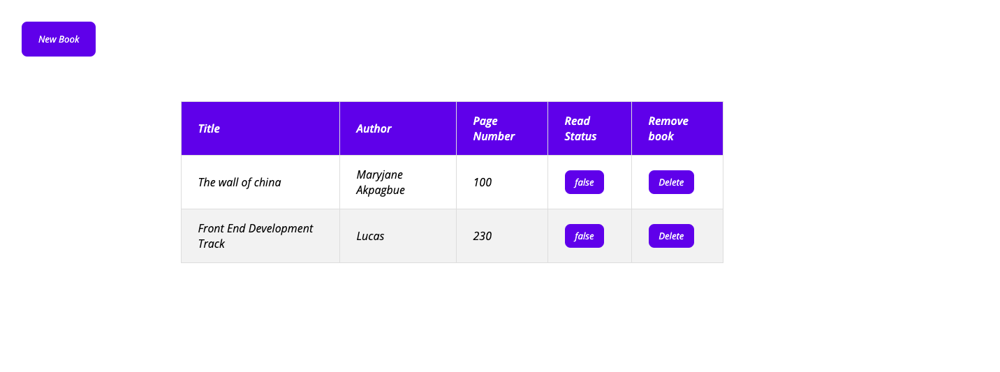
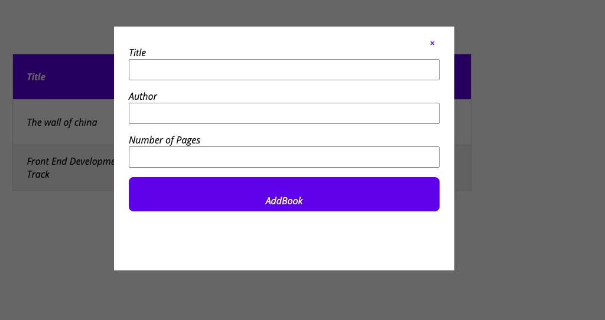

# Library - Javascript
  
[]()
[]()
[]()

## Content

<a text-align="center" href="#about">About</a>&nbsp;&nbsp;&nbsp;|&nbsp;&nbsp;&nbsp;
<a href="#with">Built with</a>&nbsp;&nbsp;&nbsp;|&nbsp;&nbsp;&nbsp;
<a href="#author">Author</a>

## About <a name = "about"></a>

This project is a simple app in which the user can add books with title, author and number of pages, delete books, and set them as read.


   
  
   

## 🔧 Built with<a name = "with"></a>

- HTML5
- CSS3
- Javascript

## 🔨 Setup

To get a local copy of the repository please run the following commands on your terminal:

```bash
$ git clone https://github.com/ldelbel/library-javascript
$ cd library-javascript
```

## ✒️  Authors <a name = "author"></a>

👤 **Maryjane Akpagbue**

- Github: [Maryjanee](https://github.com/Maryjanee)
- Twitter: [Maryjane Akpagbue](https://twitter.com/alfredmaryjane)
- Linkedin: [Maryjane Akpagbue](https://www.linkedin.com/in/maryjane-akpagbue-1500b7173/)

👤 **Lucas Delbel**

- Github: [@ldelbel](https://github.com/ldelbel)
- Twitter: [@delbel_lucas](https://twitter.com/delbel_lucas)
- Linkedin: [lucasdelbel](https://www.linkedin.com/in/lucasdelbel/)


## 🤝 Contributing

Contributions, issues and feature requests are welcome!

Feel free to check the [issues page]().


## 👍 Show your support

Give a ⭐️ if you like this project!
